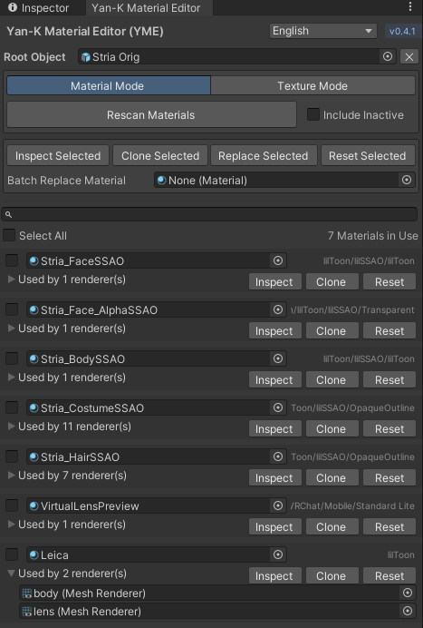
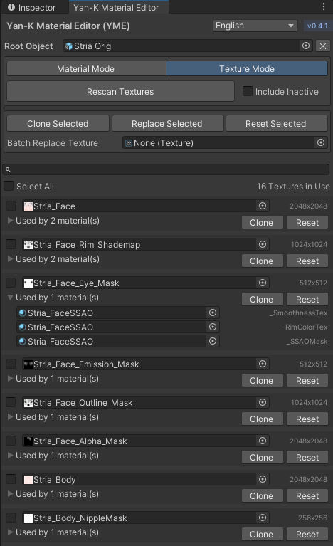

# Yan-K Material Editor (YME)

Edit Materials and Textures in Bulk

<table>
  <tr>
    <td></td>
    <td></td>
  </tr>
</table>

## Features

- **Bulk Material & Texture Management** — List, replace, clone, and reset materials and textures across all child renderers
- **Search & Filter** — Quickly find materials by name or shader, and textures by name or property
- **Batch Operations** — Select multiple items and clone, replace, or reset them all at once
- **Modified Indicator** — Visual highlight on items that have been changed from their original
- **Include Inactive** — Optionally scan inactive GameObjects, with persistent toggle across sessions
- **Confirmation Dialogs** — Destructive batch resets require confirmation to prevent accidents
- **Undo Support** — All operations are fully undoable
- **Localization** — English, 简体中文, 繁體中文, 日本語, 한국어
- **Theme Aware** — Adapts to both dark and light editor themes

## Installation

- Add to VCC via [VPM Listing from Explosive Theorem Lab.](https://xtlcdn.github.io/vpm/).
- Download .unitypackage from [Release](https://github.com/Yan-K/Material-Editor/releases) and import to Unity.

## Changelog

### v0.1.0 - 2024/11/27

Inital Release.

### v0.2.0 - 2026/04/06

Added Clone, Reset, Batch Selection, Renderer Foldout.

### v0.3.0 - 2026/04/07

Added Texture Mode.

### v0.3.1 - 2026/04/10

Added Total Number for Materials and Textures.

### v0.4.0 - 2026/04/10

UX Overhaul.

### v0.4.1 - 2026/04/10

Fixed suffix in clone.

## Credit

- Yan-K ([@YanKMW](https://github.com/Yan-K))
- Vistanz ([@JLChnToZ](https://github.com/JLChnToZ)) for VPM Listing
