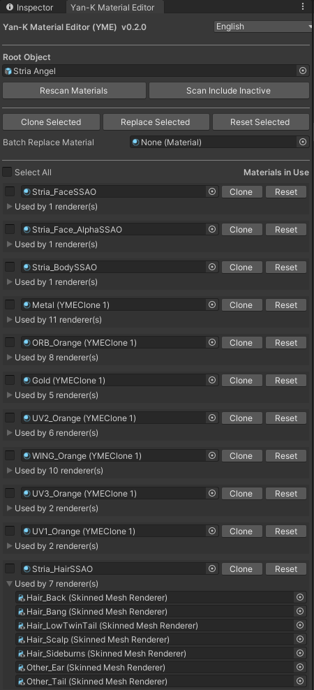

# Yan-K Material Editor (YME)

Edit Material Field in Bulk

## Features

- List used material in all child renderer  
- With or without inactive renderer  
- Replace used material in bulk  
- Clone materials  
- Undo support  
- Localization  

## Installation

- Add to VCC via [VPM Listing from Explosive Theorem Lab.](https://xtlcdn.github.io/vpm/).
- Download .unitypackage from [Release](https://github.com/Yan-K/Material-Editor/releases) and import to Unity.

## Changelog

### v0.1.0 - 2024/11/27

Inital Release.

### v0.2.0 - 2026/04/06

Added Clone, Reset, Batch Selection, Renderer Foldout.

## Credit

- Yan-K ([@YanKMW](https://github.com/Yan-K))
- Vistanz ([@JLChnToZ](https://github.com/JLChnToZ)) for VPM Listing
